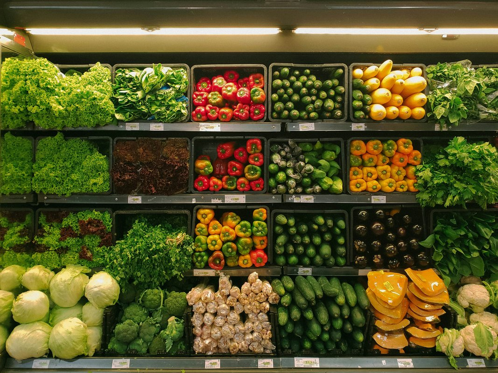

# 10 Essential Budgeting Tips for South African Students

> 💰 **Transform Your Finances:** From struggling student to money-smart graduate - your complete guide to financial freedom!

Tired of surviving on instant noodles by month-end? 🍜 Want to enjoy student life without constantly stressing about money? You're in the right place!

This isn't just another boring budgeting guide - it's your roadmap to financial freedom as a South African student. We'll show you exactly how to:

✨ **Make Your Money Work Harder**
- Track every rand without the hassle
- Find hidden savings opportunities
- Build an emergency fund that grows

🎓 **Student-Specific Strategies**
- Get the best student banking deals
- Save big on textbooks and supplies
- Find legitimate side hustles

💡 **Local Tips & Tricks**
- South African apps that save you money
- Student discounts you didn't know about
- Real examples from SA students

*Your ultimate resource for managing money as a South African student - from budgeting basics to side hustles and everything in between.*

---

## Table of Contents
1. [10 Essential Budgeting Tips for South African Students](#10-essential-budgeting-tips-for-south-african-students)
2. [Best Free Budgeting Apps in South Africa (2025)](#best-free-budgeting-apps-in-south-africa-2025)
3. [How to Save Money on Groceries as a Student](#how-to-save-money-on-groceries-as-a-student)
4. [Student Banking: Which Account Saves You the Most Money?](#student-banking-which-account-saves-you-the-most-money)
5. [Side Hustles for South African Students](#side-hustles-for-south-african-students)
6. [Conclusion & Next Steps](#conclusion--next-steps)

---

## 10 Essential Budgeting Tips for South African Students

Managing money as a student in South Africa doesn't have to be overwhelming. These practical tips will help you stretch your budget further and build healthy financial habits that last beyond university.

## 💡 Tip 1: Track Every Expense (Even the Small Ones)

> 💡 **Eye-Opener:** That R20 coffee and R15 snack habit? It could be costing you R1,050 per month! (R35 × 30 days)

### Why This Matters:
Small expenses can silently drain your budget. By tracking everything, you'll:
- Spot unnecessary spending
- Find easy ways to save
- Build better money habits
- Stay in control of your finances

### How to Do It (The Easy Way):

1. **Choose Your Tool:**
   - 📱 22seven (Free, connects to all SA banks)
   - 🏦 Your bank's app (FNB/Capitec/Standard Bank)
   - 📊 Simple spreadsheet (if you prefer manual tracking)

2. **Track Everything:**
   - Morning coffee ☕
   - Transport fares 🚌
   - Snacks & drinks 🥤
   - Study materials 📚
   - Entertainment 🎬

3. **Review Weekly:**
   - Check your spending patterns
   - Identify areas to cut back
   - Plan for the week ahead
   - Adjust your budget as needed

<h4>🌟 Pro Tip: Bank Smart!</h4>

Most South African banks now offer:
- ✅ Automatic expense categorization
- ✅ Spending analysis tools
- ✅ Budget alerts
- ✅ Zero-fee student accounts

**Recommended:** Check out 22seven - it's free and connects to all major SA banks!

### Tip 2: Create a Realistic Monthly Budget

**The 50/30/20 Rule for Students:**
- 50% for essentials (accommodation, food, transport, textbooks)
- 30% for wants (entertainment, clothing, social activities)
- 20% for savings and emergency fund

**Sample budget for R5,000 monthly allowance:**
- Essentials: R2,500 (accommodation, food, transport)
- Wants: R1,500 (entertainment, clothing)
- Savings: R1,000 (emergency fund, future goals)

### Tip 3: Take Advantage of Student Discounts

**Where to find discounts:**
- Student ID gets you discounts at most major retailers
- Check with your university's student affairs office
- Look for student-specific promotions at:
  - Pick n Pay (student discount days)
  - Clicks (student loyalty program)
  - Ster-Kinekor (student movie tickets)
  - Various restaurants and cafes near campuses

### Tip 4: Cook at Home (It's Cheaper Than You Think)

**Cost comparison:**
- Takeaway meal: R50-80
- Home-cooked meal: R15-25 per person

**Budget-friendly South African meals:**
- Pap and wors: R20 for 4 servings
- Spaghetti bolognese: R30 for 4 servings
- Chicken curry and rice: R40 for 4 servings

### Tip 5: Use Public Transport or Carpool

**Transportation costs:**
- Uber/Bolt: R30-50 per trip
- Public transport: R5-15 per trip
- Carpooling: R10-20 per trip

**Money-saving strategies:**
- Get a student transport card for discounts
- Join university carpool groups on Facebook
- Walk or cycle for short distances

### Tip 6: Buy Textbooks Smart

**Before buying new:**
- Check the university library
- Look for second-hand options on Facebook Marketplace
- Consider digital versions (often cheaper)
- Share textbooks with classmates

**Best places for affordable textbooks:**
- University bookshops (often have second-hand sections)
- Online platforms like Takealot and Loot
- Student Facebook groups

### Tip 7: Build an Emergency Fund

**Start small:** Even R100-200 per month adds up quickly.

**Why you need it:**
- Unexpected medical expenses
- Emergency travel home
- Lost or stolen items
- Unexpected course material costs

**Goal:** Aim for 3-6 months of essential expenses (R3,000-6,000 for most students).

### Tip 8: Avoid Credit Card Debt

**The reality:** Credit cards can be tempting but dangerous for students.

**Better alternatives:**
- Use debit cards for online purchases
- Save up for big purchases instead of buying on credit
- If you must use credit, pay it off immediately

### Tip 9: Take Advantage of NSFAS and Bursaries

**Maximize your funding:**
- Apply for all available bursaries
- Understand your NSFAS package completely
- Look for university-specific financial aid
- Consider work-study programs

### Tip 10: Review and Adjust Your Budget Monthly

**Monthly budget review checklist:**
- Did you stick to your budget?
- What unexpected expenses came up?
- Where can you cut costs next month?
- How much did you save?

---

## Best Free Budgeting Apps in South Africa (2025)

*Modern budgeting apps make it easy to track expenses and manage your finances on the go*

Managing your money is easier with the right tools. Here are the best free budgeting apps available to South African students.

### 1. 22seven (by Old Mutual)

**Best for:** Comprehensive financial overview

**Features:**
- Connects to all major South African banks
- Automatic transaction categorization
- Budget tracking and alerts
- Investment tracking
- Free tier includes basic budgeting features

**Why students love it:** Easy to use, South African-focused, and integrates with local banks.

### 2. FNB Banking App

**Best for:** FNB customers

**Features:**
- Built-in budgeting tools
- Spending categorization
- Goal setting
- Free for FNB customers

**Student bonus:** FNB offers special student accounts with reduced fees.

### 3. Capitec Banking App

**Best for:** Capitec customers

**Features:**
- Simple budgeting interface
- Transaction history and categorization
- Goal tracking
- Free for Capitec customers

**Why it's great for students:** Capitec is known for low fees and student-friendly accounts.

### 4. Standard Bank Mobile Banking

**Best for:** Standard Bank customers

**Features:**
- Budgeting tools
- Spending insights
- Goal setting
- Free for Standard Bank customers

### 5. YNAB (You Need A Budget)

**Best for:** Serious budgeters

**Features:**
- Zero-based budgeting
- Goal tracking
- Debt payoff planning
- Free for students (with valid student email)

**Note:** While not South African, it's highly effective for budgeting.

### 6. Goodbudget

**Best for:** Envelope budgeting

**Features:**
- Digital envelope system
- Shared budgets (great for roommates)
- Free tier available
- Works offline

---

## How to Save Money on Groceries as a Student

Groceries can eat up a significant portion of your budget. Here's how to shop smart and save money on food as a South African student.

### Plan Your Meals Weekly

**Benefits:**
- Reduces food waste
- Prevents impulse purchases
- Saves time and money

**How to meal plan:**
1. Check what you already have
2. Plan 5-7 meals for the week
3. Write a detailed shopping list
4. Stick to the list when shopping

### Shop at the Right Stores

**Budget-friendly options:**
- **Shoprite:** Best for basic groceries and household items
- **Pick n Pay:** Good variety and student discounts
- **Spar:** Convenient but slightly more expensive
- **Food Lover's Market:** Great for fresh produce
- **Local markets:** Often cheaper for fresh vegetables

### Buy Generic Brands

**Savings potential:** 20-40% on most items

**Items where generic is just as good:**
- Rice, pasta, and grains
- Basic cleaning products
- Canned goods
- Some dairy products

### Use Loyalty Programs

**Major programs to join:**
- **Pick n Pay Smart Shopper:** Earn points on every purchase
- **Shoprite Xtra Savings:** Exclusive deals and discounts
- **Clicks ClubCard:** Points on health and beauty products
- **Dis-Chem Benefits:** Rewards on pharmacy and health items

### Buy in Bulk (When It Makes Sense)

**Good bulk buys:**
- Rice and pasta
- Toilet paper and cleaning supplies
- Non-perishable snacks
- Frozen vegetables

**Avoid bulk buying:**
- Fresh produce (unless you'll use it all)
- Items you're trying for the first time
- Perishable items

### Cook in Batches

**Time and money saver:**
- Cook large portions on weekends
- Freeze individual portions
- Reduces cooking time during the week
- Prevents ordering takeaway

**Great batch cooking recipes:**
- Spaghetti bolognese
- Chicken curry
- Vegetable soup
- Mince and rice

### Shop Seasonally

**When produce is cheapest:**
- Summer: Tomatoes, corn, stone fruits
- Winter: Citrus fruits, root vegetables
- Spring: Asparagus, peas, strawberries
- Autumn: Apples, pears, pumpkins

---

## Student Banking: Which Account Saves You the Most Money?

Choosing the right bank account can save you hundreds of rands per year. Here's a comparison of student accounts from major South African banks.

### Capitec Student Account

**Monthly fees:** R0 (completely free)

**Features:**
- No monthly account fees
- Free ATM withdrawals at Capitec ATMs
- Low fees for other bank ATMs
- Free online and mobile banking
- No minimum balance requirements

**Best for:** Students who want zero monthly fees and simple banking.

### FNB Student Account

**Monthly fees:** R0 (with conditions)

**Features:**
- Free if you're under 25 and studying
- Free eBucks rewards program
- Free online banking
- Student-specific benefits and discounts

**Conditions:**
- Must be under 25
- Must be a full-time student
- Some transaction fees apply

### Standard Bank Student Account

**Monthly fees:** R0 (with conditions)

**Features:**
- Free for students under 26
- Free online banking
- Access to student loans and credit
- Student-specific rewards

**Conditions:**
- Must be under 26
- Must provide proof of enrollment

### Absa Student Account

**Monthly fees:** R0 (with conditions)

**Features:**
- Free for students under 25
- Free online banking
- Student loan options
- Rewards program

**Conditions:**
- Must be under 25
- Must be a full-time student

### Nedbank Student Account

**Monthly fees:** R0 (with conditions)

**Features:**
- Free for students under 26
- Free online banking
- Student-specific benefits
- Access to student loans

**Conditions:**
- Must be under 26
- Must provide proof of enrollment

### Comparison Summary

| Bank | Monthly Fee | Age Limit | Best For |
|------|-------------|-----------|----------|
| Capitec | R0 | No limit | Zero fees, simplicity |
| FNB | R0 | Under 25 | Rewards, comprehensive banking |
| Standard Bank | R0 | Under 26 | Traditional banking, loans |
| Absa | R0 | Under 25 | Student loans, rewards |
| Nedbank | R0 | Under 26 | Traditional banking |

**Winner:** Capitec for pure cost savings, FNB for features and rewards.

---

## Side Hustles for South African Students

Earning extra money while studying is easier than you think. Here are legitimate side hustles perfect for South African students.

### Online Opportunities

#### 1. Freelance Writing and Content Creation

**Earning potential:** R200-500 per article

**How to start:**
- Create profiles on Upwork, Fiverr, and PeoplePerHour
- Start with local South African clients
- Build a portfolio with sample work
- Specialize in topics you know (academic subjects, hobbies)

**Tips for success:**
- Start with lower rates to build reviews
- Focus on quality over quantity
- Network with other freelancers
- Keep improving your writing skills

#### 2. Online Tutoring

**Earning potential:** R150-300 per hour

**Subjects in demand:**
- Mathematics and Science
- English and Afrikaans
- Computer Science
- Business Studies

**Platforms to use:**
- Tutorful
- Preply
- Local Facebook groups
- University notice boards

#### 3. Virtual Assistant Services

**Earning potential:** R50-150 per hour

**Services you can offer:**
- Email management
- Social media management
- Data entry
- Research tasks
- Customer service

**How to find clients:**
- Facebook groups for small businesses
- LinkedIn networking
- Freelance platforms
- Word of mouth

### Local Opportunities

#### 4. Part-Time Retail Work

**Earning potential:** R25-50 per hour

**Best places to work:**
- Shopping malls near campus
- Restaurants and cafes
- Clothing stores
- Electronics stores

**Benefits:**
- Flexible hours
- Employee discounts
- Steady income
- Work experience

#### 5. Event Staffing

**Earning potential:** R200-500 per event

**Types of events:**
- Concerts and festivals
- Corporate events
- Weddings
- Sports events

**How to find work:**
- Event staffing agencies
- Facebook event groups
- University event departments
- Word of mouth

#### 6. Pet Sitting and Dog Walking

**Earning potential:** R100-200 per day

**Services to offer:**
- Dog walking
- Pet sitting
- House sitting
- Pet grooming (if you have skills)

**How to find clients:**
- Facebook community groups
- Pet sitting apps
- Local veterinary clinics
- Word of mouth

### Campus-Based Opportunities

#### 7. Student Ambassador Programs

**Earning potential:** R1,000-3,000 per month

**What you'll do:**
- Represent brands on campus
- Organize events
- Social media promotion
- Market research

**How to apply:**
- Check university career services
- Look for brand ambassador programs
- Apply through company websites
- Network with other ambassadors

#### 8. Campus Tour Guide

**Earning potential:** R150-300 per tour

**Requirements:**
- Good knowledge of campus
- Friendly personality
- Good communication skills
- Available during peak times

#### 9. Research Assistant

**Earning potential:** R100-200 per hour

**How to find opportunities:**
- Check university job boards
- Approach professors directly
- Look for research projects
- Join academic societies

### Creative Opportunities

#### 10. Photography Services

**Earning potential:** R500-2,000 per event

**Services to offer:**
- Event photography
- Portrait sessions
- Social media content
- Product photography

**How to start:**
- Build a portfolio
- Start with friends and family
- Use social media for marketing
- Network with event organizers

#### 11. Graphic Design

**Earning potential:** R300-1,000 per project

**Services to offer:**
- Logo design
- Social media graphics
- Flyers and posters
- Business cards

**Tools to learn:**
- Canva (free)
- Adobe Creative Suite
- GIMP (free alternative)
- Figma (free)

### Tips for Success

**Time management:**
- Set specific hours for side hustles
- Don't let work interfere with studies
- Use a calendar to plan your time
- Learn to say no when necessary

**Financial management:**
- Keep track of all income
- Set aside money for taxes
- Save a portion of earnings
- Don't rely on side hustle income for essentials

**Building your brand:**
- Create professional social media profiles
- Build a portfolio website
- Ask for reviews and testimonials
- Network with other students and professionals

---

## Conclusion & Next Steps

Managing money as a South African student doesn't have to be stressful. By following these budgeting tips, using the right tools, and exploring side hustle opportunities, you can not only survive but thrive financially during your studies.

### Your Action Plan

1. **Start today** by downloading a budgeting app and tracking your first expense
2. **Choose a student bank account** that fits your needs (we recommend Capitec for zero fees)
3. **Create a monthly budget** using the 50/30/20 rule
4. **Plan your meals** for the week and shop with a list
5. **Explore one side hustle** that interests you and fits your schedule
6. **Review your progress** monthly and adjust as needed

### Remember

- Small changes add up to big savings
- Consistency is more important than perfection
- Don't be afraid to ask for help or advice
- Your financial habits now will impact your future

### Resources to Keep Handy

- **NSFAS website:** For financial aid information
- **Your university's financial aid office:** For local resources
- **South African Reserve Bank:** For economic updates
- **National Credit Regulator:** For credit-related information

**Start your financial journey today by tracking your first expense. Every successful financial future begins with a single step.**

---

*This guide is updated for 2025 and reflects current South African banking, retail, and student life conditions. Always verify current fees and terms with individual institutions.*

**Keywords:** budgeting tips for students South Africa, student banking South Africa, free budgeting apps South Africa, student side hustles South Africa, save money on groceries students, NSFAS budgeting, Capitec student account, FNB student banking, student financial planning South Africa
